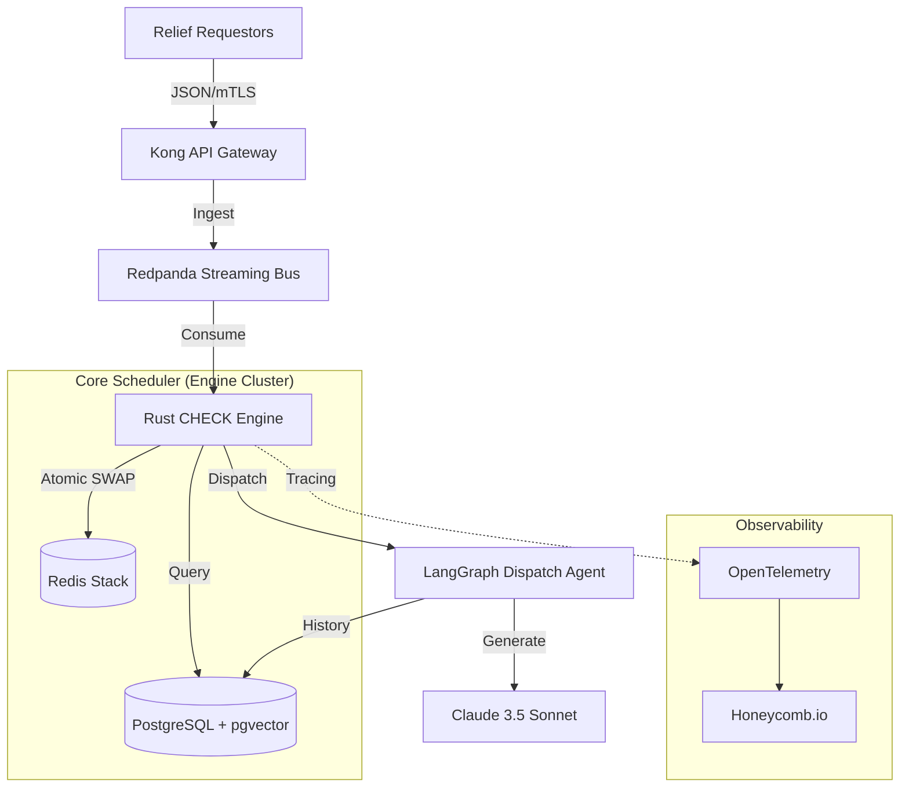

# CRCN Industrialized Architecture: The "Antigravity" Blueprint

The Central Relief Coordination Network (CRCN) must transition from a conceptual graph model to a battle-hardened, distributed system. This blueprint outlines the technologies and patterns required to handle 10k+ requests/sec with sub-millisecond preemption logic.

## 1. High-Level Architecture Overview



---

## 2. The Tech Stack Layers

### Layer 1: Infrastructure (Foundation)
*   **Platform**: **AWS EKS** (Managed Kubernetes) across 3 Availability Zones.
*   **Service Mesh**: **Istio** for mTLS between the CHECK engine and the RAG agents.
*   **Infrastructure as Code**: **Terraform** for reproducible environments.

### Layer 2: Ingestion & Durability
*   **Message Broker**: **Redpanda**. It is written in C++, provides 10x lower latency than Kafka, and eliminates JVM garbage collection pauses which could delay critical preemption.
*   **Serialization**: **Protocol Buffers (Protobuf)** for minimal payload size and strict schema enforcement.

### Layer 3: The CHECK Engine (The Brain)
*   **Language**: **Rust**. 
    *   *Why?* Memory safety without a garbage collector. In a high-pressure dispatch system, a "Stop the World" GC pause is unacceptable.
*   **Concurrency**: **Tokio** runtime for non-blocking I/O.
*   **Atomic Operations**: The `findWeakestSlot()` and `SWAP` logic is implemented as **Redis Lua scripts**. This ensures that the state of the active slots and the WaitingPool is updated atomically across the cluster.

### Layer 4: Storage & State
*   **Active State**: **Redis Sorted Sets (ZSETs)**.
    *   `ZPOPMAX` handles the WaitingPool max-heap logic in $O(\log N)$.
    *   `ZSCORE` provides $O(1)$ access to slot urgency.
*   **Long-term Storage**: **PostgreSQL** with **TimescaleDB** for audit logs and historical analysis.
*   **Vector Search**: **pgvector** to store incident embeddings for the RAG agent.

### Layer 5: AI & RAG Agent
*   **Orchestration**: **LangGraph**. Unlike LangChain, LangGraph allows for "cyclical" workflows, which is perfect for a dispatcher that might need to re-query context if initial retrieval is insufficient.
*   **Foundation Model**: **Claude 3.5 Sonnet**. Known for its superior reasoning in complex, high-stakes scenarios.

---

## 3. Distributed Atomic SWAP Logic

The SWAP is the heart of CRCN. In production, it must be idempotent and atomic.

```lua
-- Production SWAP (Redis Lua)
local slot_id = KEYS[1]
local pool_key = "crcn:waitingpool"
local incoming_node_id = ARGV[1]
local incoming_urgency = tonumber(ARGV[2])

-- 1. Get the current holder
local current_holder = redis.call('GET', slot_id)

-- 2. If slot wasn't empty, move current holder to WaitingPool
if current_holder then
    local current_urgency = redis.call('GET', 'node:' .. current_holder .. ':urgency')
    redis.call('ZADD', pool_key, current_urgency, current_holder)
end
## 5. Advanced System Upgrades

### Upgrade 1: Starvation Prevention (Urgency Aging)
To prevent "starvation" of low-priority tasks, CRCN implements dynamic priority aging. Instead of sorting by raw urgency, the WaitingPool uses an **Effective Score**:
$$EffectiveScore = Urgency + (AgingRate \times TicksWaited)$$
This ensures that even a MEDIUM request will eventually exceed a CRITICAL base score and move to the CHECK node.

### Upgrade 2: Chaos Recovery (TTL Slot Leases)
In a distributed environment, slot ownership is protected by a **Heartbeat Lease**.
*   **Heartbeat**: Resources must renew their lease every 3 seconds.
*   **Automatic Reclaim**: If the lease expires (TTL = 10s), the CHECK engine automatically re-queues the task into the WaitingPool and frees the slot for the next highest priority request.

---

## 6. Formal Complexity & Correctness

### Operational Complexity
| Operation | Structure | Time Complexity | Proof |
| :--- | :--- | :--- | :--- |
| `findWeakestSlot()` | Array Scan | $O(N_{slots})$ | Linear scan of $n$ active slots. |
| `SWAP` Atomic | Redis Lua | $O(\log W)$ | `ZREM` and `ZADD` on WaitingPool. |
| `drainWaitingPool()`| Heap Pop | $O(\log W)$ | $W$ = WaitingPool size. |
| `dispatchRAG()` | Heap Peek | $O(1)$ | Constant time peek at heap top. |

### Starvation-Free Correctness Proof
**Theorem**: No request waits indefinitely in the WaitingPool.
**Proof**: Let $r$ be a request with base urgency $u \ge 1$ and aging rate $\alpha > 0$. Its effective score at time $t$ is $f(t) = u + \alpha t$. Since $\alpha$ is positive, $f(t)$ is strictly monotonically increasing and unbounded. The maximum possible blocking score is 3 (CRITICAL base). By the Archimedean property, $\exists T$ such that $u + \alpha T > 3$. At time $T$, request $r$ is guaranteed to preempt any standard slot holder. Therefore, no request waits longer than $T = (3 - u) / \alpha$ ticks. **Q.E.D.**

---

## 7. Load Testing & Chaos Specification

### Target SLAs
*   **Ingestion**: 10,000 req/sec via Redpanda.
*   **P99 Latency**: Arrival → Queue entry < 50ms.
*   **Critical Latency**: Wait time < 200ms under heavy contention.

### Chaos Scenarios
1.  **Pod Failure**: Terminate 1 of $N$ resource pods → Verify TTL lease reclaims slot within 10s.
2.  **Redis Failover**: Disrupt Redis Primary → Verify replica promotion with zero data loss.
3.  **Burst Contention**: Inject 10,000 Simultaneous CRITICAL requests → Verify order-of-arrival vs urgency fairness.

-- 3. Install the new critical node
redis.call('SET', slot_id, incoming_node_id)
-- ... update local analytics ...
return "OK"
```

## 4. Next Steps: Visualization Prototype
I am currently initializing a **High-Fidelity Dashboard** to visualize this system in real-time. This dashboard will simulate:
1.  **Request Influx**: Randomized incident generation.
2.  **Preemption Visuals**: Visual representation of nodes "ejecting" and "swapping".
3.  **Heap States**: Live views of the WaitingPool.

> [!NOTE]
> This stack isn't just about speed; it's about **determinism**. Every choice (Rust, Redpanda, Redis Lua) is designed to ensure that the most critical task is handled within a predictable time window.
